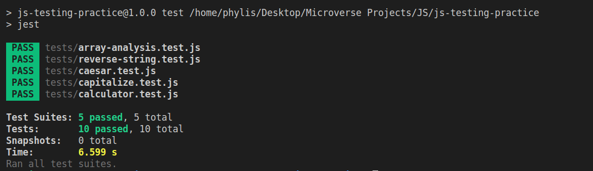

# js-testing-practice
This project demonstrates testing JavaScript files using Jest, its specifications found in [The Odin Project](https://www.theodinproject.com/courses/javascript/lessons/testing-practice?ref=lnav)

## Web App Screenshots

## Built With

- Javascript

## Getting Started

To get a local copy up and running follow these simple example steps.

### Prerequisites

- npm
- webpack
- jest

### Setup

- Clone the repository.
- cd into js-testing-practice folder
- Run `npm install`
- Run `npm run test` from your command line

## Authors

👤 **Christopher Amanor**

- Github: [@krys2fa](https://github.com/krys2fa)
- Twitter: [@krys2fa](https://twitter.com/krys2fa)
- Linkedin: [Christopher Amanor](https://www.linkedin.com/in/christopher-amanor/)

👤 **Phylis Chepchumba**

- Github: [@Phylis05](https://github.com/Phylis05)
- Linkedin: [PhylisChepchumba](https://linkedin.com/PhylisChepchumba)
- Twitter: [chepchumba05](https://twitter.com/chepchumba05)

## 🤝 Contributing

Contributions, issues and feature requests are welcome!

Feel free to check the [issues page](https://github.com/krys2fa/js-testing-practice/issues).

## Show your support

Kindly give this repository a ⭐️ if you like this project!

## Acknowledgments

- Project specifications by [Microverse](https://www.microverse.org) and [The Odin Project](https://www.theodinproject.com/courses/javascript/lessons/testing-practice?ref=lnav).

## 📝 License

This project is licensed under the MIT License.
